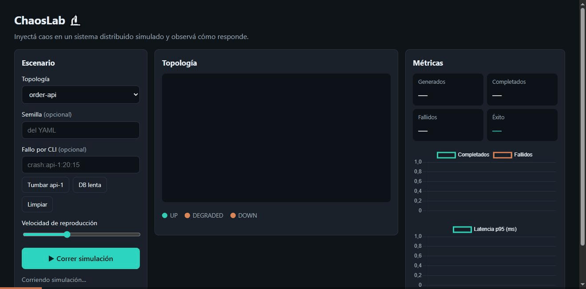

# ChaosLab 🔬

> Simulador educativo de sistemas distribuidos y *chaos engineering*. Define tu arquitectura
> en YAML, se levanta una simulación **en memoria** (sin infraestructura real) e inyectas fallos
> —latencia, caídas, particiones de red— para ver cómo responde el sistema y cómo lo defienden
> los patrones de resiliencia.

La versión de aprendizaje de Chaos Monkey: barata, visible y reproducible.



> El dashboard corriendo dos escenarios con el **mismo** `CrashFault` en una réplica: primero
> `order-api` (sin defensas) cae al **83%** de éxito y su latencia p95 se dispara; luego
> `resilient-order-api` (con **CircuitBreaker** en el balanceador) **degrada en vez de colapsar** y
> mantiene el **100%**. Mismo `seed` → mismo resultado.

## Probalo en 1 minuto

Requiere **JDK 21** (para compilar *y* ejecutar; con un JDK por defecto < 21 el build usa Maven
Toolchains, pero el jar corre sobre Java 21).

```bash
mvn -DskipTests package                                           # compila el jar
java -jar target/chaoslab-0.1.0-SNAPSHOT.jar                      # dashboard: http://localhost:8080
java -jar target/chaoslab-0.1.0-SNAPSHOT.jar run examples/order-api.yaml   # o por CLI
```

En el dashboard: elegí una topología (o **pegá/subí tu propio YAML**), sumá un fallo opcional
(botón *Tumbar api-1* o un spec como `crash:api-1:20:15`), y dale **Correr**. Compará `order-api`
con `resilient-order-api` para ver el CircuitBreaker en acción.

---

## Estado

- ✅ **Fase 0 — Fundación:** Clean Architecture, gates de calidad y CI.
- ✅ **Fase 1 — Motor:** eventos discretos deterministas, 4 componentes, YAML + CLI.
- ✅ **Fase 2 — Caos y resiliencia:** 3 fallos (latencia, caída, partición) y 3 patrones
  (Retry, Timeout, CircuitBreaker).
- 🚧 **Fase 3 — Dashboard en tiempo real** (en construcción).

## Stack

- **Java 21 LTS** + **Spring Boot 3.5** (solo en las capas externas; el dominio es puro)
- Motor de **eventos discretos** propio · **Picocli** (CLI) · **Spring WebSocket/STOMP** (dashboard)
- **JUnit 5 + AssertJ** · **Checkstyle** · **SpotBugs** · **JaCoCo** · **OWASP Dependency-Check**
- **GitHub Actions** (CI) · **Docker** (entorno reproducible)

## Arquitectura

Monolito modular con Clean Architecture. La dependencia **siempre apunta hacia adentro**:

```
Infrastructure  →  Application  →  Domain
   (adaptadores)   (casos de uso)   (motor puro: cero Spring/web/YAML)
```

```
src/main/java/com/chaoslab/
├── domain/            ← núcleo, cero dependencias externas
│   ├── engine/        ← Clock, EventQueue, SimulationEngine (eventos discretos), eventos sellados
│   ├── topology/      ← Component, Service, Queue, Database, LoadBalancer, TopologyGraph
│   ├── fault/         ← Fault (sellado): LatencyFault, CrashFault, NetworkPartition
│   ├── resilience/    ← CircuitBreaker, ResiliencePolicy (Retry / Timeout)
│   ├── workload/      ← generador de carga (Poisson, sembrado)
│   └── metrics/       ← MetricsCollector, SimulationReport, percentiles
├── application/       ← casos de uso (orquestan el dominio)
└── infrastructure/    ← adaptadores: yaml, cli, (web en Fase 3)
```

### Decisiones de arquitectura (ADRs)

- [0001 — Motor de eventos discretos determinista](docs/adr/0001-motor-eventos-discretos-determinista.md)
- [0002 — Dashboard por replay de línea de tiempo (no WebSocket)](docs/adr/0002-timeline-replay-vs-websocket.md)
- [0003 — Monolito modular con Clean Architecture](docs/adr/0003-monolito-modular-clean-architecture.md)

## Requisitos

- JDK 21 (Temurin recomendado). Si tu JDK por defecto es < 21, el build usa **Maven Toolchains**
  para compilar con JDK 21 (ver `~/.m2/toolchains.xml`).
- Maven 3.9+
- `.mvn/jvm.config` fuerza `-Djava.net.preferIPv4Stack=true` para evitar fallos de resolución de
  Maven Central en entornos con IPv6 roto; es inocuo donde IPv6 funciona.

## Comandos

```bash
# Build completo: compila + tests + Checkstyle + SpotBugs + gate de cobertura JaCoCo
mvn verify

# Correr una simulación (los fallos definidos en el YAML se inyectan solos)
java -jar target/chaoslab-0.1.0-SNAPSHOT.jar run examples/order-api.yaml

# Inyectar fallos por CLI (repetible): crash:<target>:<atSeg>[:<durSeg>],
# latency:<target>:<atSeg>:<durSeg>:<extraMs>, partition:<a,b>:<c>:<atSeg>:<durSeg>
java -jar target/chaoslab-0.1.0-SNAPSHOT.jar run examples/order-api.yaml --fault crash:api-1:10:20

# Solo lint de estilo / solo tests
mvn checkstyle:check
mvn test
```

Tras `mvn verify`, el reporte de cobertura queda en `target/site/jacoco/index.html`.

## El "momento ajá": caos vs. resiliencia

Misma topología y mismo `CrashFault` en una réplica; lo único que cambia es un CircuitBreaker
en el balanceador:

```bash
java -jar target/chaoslab-0.1.0-SNAPSHOT.jar run examples/order-api.yaml            # sin breaker
java -jar target/chaoslab-0.1.0-SNAPSHOT.jar run examples/resilient-order-api.yaml  # con breaker
```

| Réplica caída | Sin CircuitBreaker | Con CircuitBreaker |
|---|---|---|
| Tasa de éxito | ~83 % | **100 %** |

Con el breaker, el balanceador deja de enrutar a la réplica caída y el sistema **degrada en vez
de colapsar**. Mismo `seed` → mismo resultado siempre (determinismo).

## Hipótesis de estado estable (el oráculo)

El principio formal de Chaos Engineering: declarás qué es "operación normal" con invariantes
medibles (SLOs) y el experimento intenta **refutarlos**. En ChaosLab se declaran en el YAML y la
corrida devuelve un veredicto **PASA/FALLA**:

```yaml
steady_state:
  - { metric: success_rate,   comparison: ">=", threshold: 0.99 }
  - { metric: p95_latency_ms, comparison: "<=", threshold: 400 }
```

- **Métricas:** `success_rate`, `p50/p95/p99/max_latency_ms`,
  `completed/failed/generated_requests`.
- **Comparadores:** `>=`, `<=`, `>`, `<`, `==` (o `gte`, `lte`, `gt`, `lt`, `eq`).
- En el **dashboard** aparece un badge verde/rojo con el desglose por invariante.
- En la **CLI**, si la hipótesis se refuta el proceso sale con **código 1** (listo para un gate de
  CI: la resiliencia se vuelve un test que rompe el build si regresa).

Las dos topologías del "momento ajá" traen la misma hipótesis (`success_rate >= 0.99`):
`order-api` la **refuta** (~0.83) y `resilient-order-api` la **cumple** (~1.0).

Además, cada corrida reporta **métricas de resiliencia** estandarizadas: disponibilidad, MTTR,
tasa de éxito en el peor segundo y en cuánto tiempo se detectó el fallo (apertura del breaker).

## Búsqueda de caos (mini-DST): "encontrá el escenario que te rompe"

En vez de reproducir un escenario que vos definís, ChaosLab **busca solo** el conjunto de fallos que
refuta tu hipótesis, y lo **minimiza** al más chico que aún la rompe (idea de la _Deterministic
Simulation Testing_ de FoundationDB/Antithesis/TigerBeetle, a escala educativa):

```bash
java -jar target/chaoslab-0.1.0-SNAPSHOT.jar search examples/resilient-order-api.yaml
```

```
veredicto: hipótesis REFUTADA — escenario mínimo hallado
  semilla: 0
  fallos (1): crash orders-queue
  éxito en el peor segundo: 0.0%
```

El diseño resiliente cubre las réplicas `api` con un CircuitBreaker, pero la búsqueda descubre que
la **cola y la base de datos son puntos únicos de fallo** (SPOF): un solo crash de `orders-queue`
tira el SLO. Como todo es determinista, el contraejemplo es **reproducible** (misma semilla +
mismos fallos). Sale con **código 1** si halla un contraejemplo (gate de resiliencia para CI).

## Docker

```bash
# Levanta el dashboard en http://localhost:8080
docker compose up --build
```

La imagen es multi-etapa (compila con Maven+JDK 21, corre sobre un JRE 21); no necesitás Java 21
instalado localmente para usarla.

En el dashboard podés correr una de las topologías de ejemplo **o cargar la tuya**: desplegá
*"…o usá tu propio YAML"*, pegá o subí tu archivo, y corré. También por CLI:
`java -jar target/chaoslab-0.1.0-SNAPSHOT.jar run mi-topologia.yaml`.

## Calidad y gates

| Gate | Herramienta | Umbral |
|---|---|---|
| Estilo | Checkstyle | 0 violaciones (warning+) |
| Bugs estáticos | SpotBugs | 0 (effort Max, threshold Medium) |
| Cobertura del dominio | JaCoCo | ≥ 70 % líneas en `com.chaoslab.domain` |
| Vulnerabilidades de dependencias | OWASP Dependency-Check | falla si CVSS ≥ 7 (perfil `security`) |

El análisis de dependencias (OWASP) corre en un workflow nocturno propio
([.github/workflows/security.yml](.github/workflows/security.yml)) porque la descarga de la base
NVD es lenta; los PRs y pushes corren solo lint + tests para feedback rápido.

## Licencia

[MIT](LICENSE) · Sebastian Ramirez · ITM Medellín · 2026
